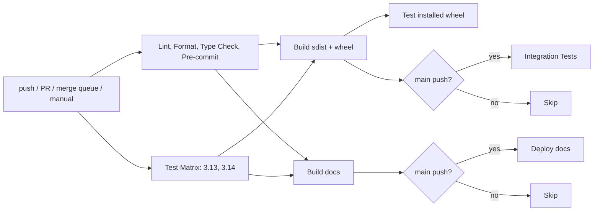
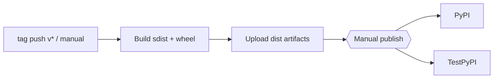

<!-- START doctoc generated TOC please keep comment here to allow auto update -->

**Table of Contents**  *generated with [DocToc](https://github.com/thlorenz/doctoc)*

- [CI/CD (2026) Overview](#cicd-2026-overview)
  - [Pipeline At A Glance](#pipeline-at-a-glance)
  - [Release Pipeline (Build + Optional Publish)](#release-pipeline-build-optional-publish)
  - [Release Checklist (Small And Practical)](#release-checklist-small-and-practical)
  - [Triggers](#triggers)
  - [Jobs](#jobs)
    - [Lint, Format, Type Check, Pre-commit](#lint-format-type-check-pre-commit)
    - [Test (Matrix)](#test-matrix)
    - [Build (sdist + wheel)](#build-sdist-wheel)
    - [Test Installed Wheel](#test-installed-wheel)
    - [Docs](#docs)
    - [Integration](#integration)
  - [Caching Strategy](#caching-strategy)
  - [Performance & Minimalism Principles](#performance-minimalism-principles)
  - [Future Proofing](#future-proofing)
  - [Versioning System (2026 Best Practice)](#versioning-system-2026-best-practice)
  - [Build System In `pyproject.toml` (2026 Best Practice)](#build-system-in-pyprojecttoml-2026-best-practice)
  - [Enabling PyPI / TestPyPI Publishing](#enabling-pypi-testpypi-publishing)
  - [Files](#files)

<!-- END doctoc generated TOC please keep comment here to allow auto update -->

# CI/CD (2026) Overview

This repo uses a modern, minimal, and fast GitHub Actions pipeline designed for 2026 best practices:

- Fast feedback with cached `uv` dependencies and short job timeouts.
- Minimal surfaces: only the necessary jobs for lint, test, build, docs, and gated integration.
- Future-proofing: merge queue support, path filters, and explicit permissions.

## Pipeline At A Glance



## Release Pipeline (Build + Optional Publish)

The release workflow builds sdist + wheel on tag pushes (`v*`) or manual runs.
Publishing to PyPI/TestPyPI is manual and controlled by workflow inputs.



## Release Checklist (Small And Practical)

1. Choose the next version using PEP 440 (see guidance below).
2. Update `pyproject.toml` version and `CHANGELOG.md`.
3. Tag the release: `git tag vX.Y.Z` and push the tag.
4. Confirm `Release` workflow builds artifacts.
5. (Optional) Run the Release workflow manually with `publish_target=testpypi`.
6. Validate the TestPyPI release.
7. Run the Release workflow manually with `publish_target=pypi`.

## Triggers

- `push` on `main` or `develop`, scoped to relevant paths.
- `pull_request` to `main`, scoped to relevant paths.
- `merge_group` for merge queue support.
- `workflow_dispatch` for manual runs.

## Jobs

### Lint, Format, Type Check, Pre-commit

- Installs `uv`, caches the global `uv` cache.
- Installs dev + types extras.
- Runs `ruff check`, `ruff format --check`, `pyright`, and `pre-commit`.

### Test (Matrix)

- Python `3.13` and `3.14`.
- Caches `uv` per Python version.
- Runs pytest with coverage and uploads to Codecov.

### Build (sdist + wheel)

- Builds artifacts using `uv build`.
- Uploads `dist/` artifacts for reuse.

### Test Installed Wheel

- Installs the built wheel and runs a small smoke test to ensure packaging is correct.

### Docs

- Builds docs with MkDocs and deploys to GitHub Pages on `main`.

### Integration

- Runs only on `push` to `main`.
- Installs Playwright Chromium and runs integration tests.

## Caching Strategy

We cache the global `uv` cache directory to avoid repeated downloads:

```mermaid
flowchart LR
  A[uv cache dir] --> B[actions/cache@v4]
  B --> C[Restore on next run]
```

## Performance & Minimalism Principles

- Use path filters to avoid running CI on non-code changes.
- Use `uv` for fast dependency resolution and installation.
- Fail fast on lint/type issues.
- Use tight job timeouts to avoid wasted runner minutes.

## Future Proofing

- `merge_group` ensures compatibility with GitHub merge queue.
- Explicit `permissions` for least-privilege by default.
- Centralized Python version in workflow `env`.

## Versioning System (2026 Best Practice)

Use PEP 440 as the canonical versioning scheme for Python packages. PEP 440 is the
accepted standard in the Python ecosystem and is what packaging tools expect.
You can still follow a SemVer-like pattern (`X.Y.Z`) as long as it remains valid
PEP 440. Pre-releases and dev builds should use PEP 440 suffixes like `a`, `b`,
`rc`, and `.devN`.

## Build System In `pyproject.toml` (2026 Best Practice)

Best practice is to declare a PEP 517 build backend in `[build-system]` and use
standards-based metadata in `[project]` (PEP 621). This repo uses `uv_build`,
which is fast and aligned with uv-native workflows for pure-Python packages.

## Enabling PyPI / TestPyPI Publishing

Publishing is manual and controlled via `workflow_dispatch` inputs. Configure
PyPI Trusted Publishing for this GitHub repo and add environment protections in
GitHub for `pypi` and `testpypi`.

## Files

- Workflow: `.github/workflows/ci.yml`
- Release workflow: `.github/workflows/release.yml`
- This doc: `docs/dev/ci-cd.md`
